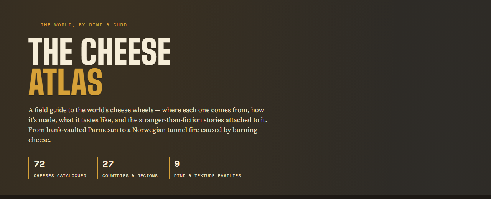
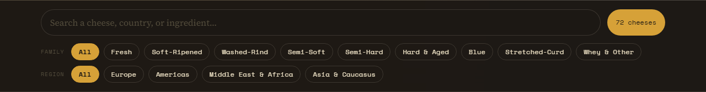
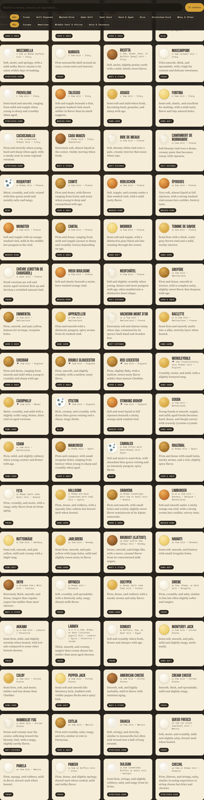
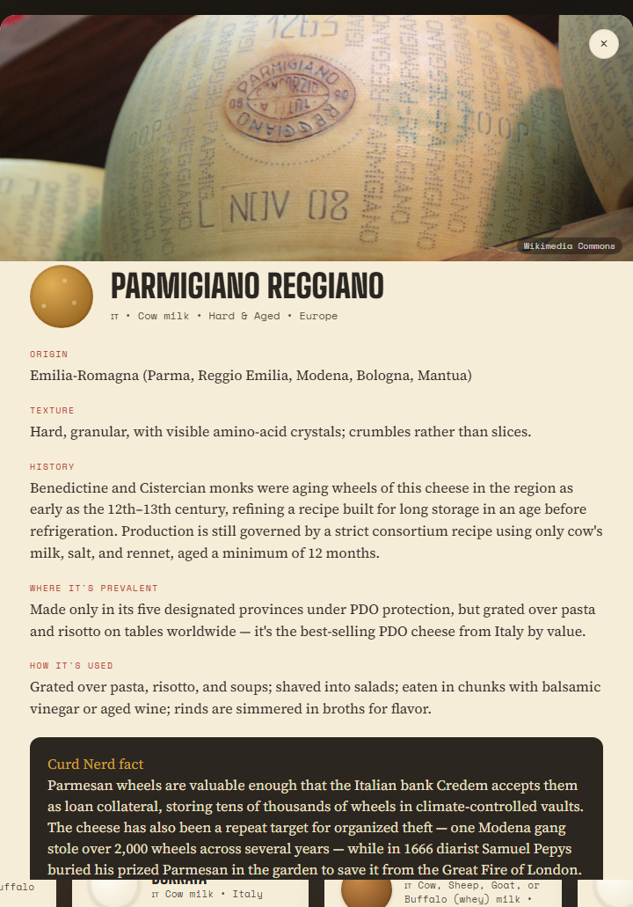
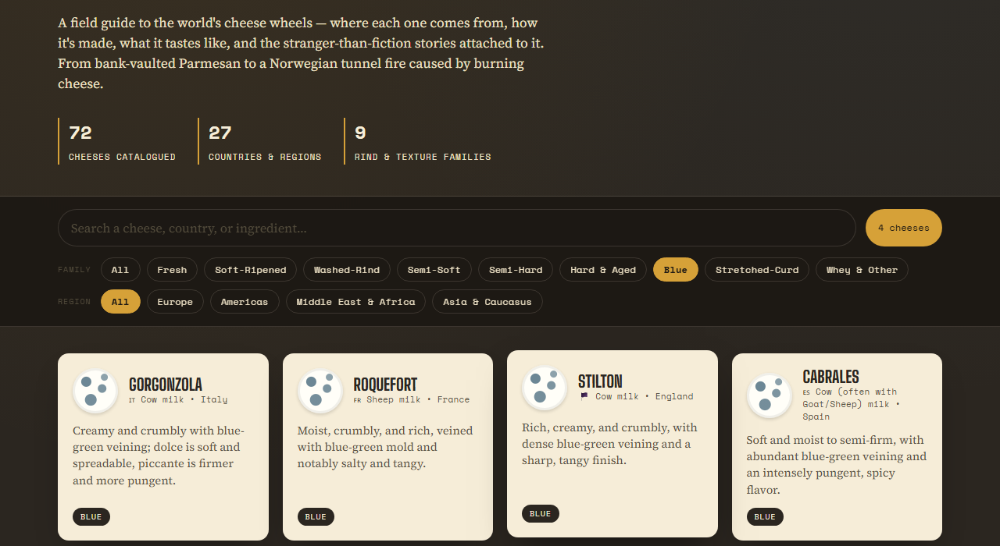

# The Cheese Atlas

[](https://the-cheese-atlas.vercel.app/)

**A field guide to the world's cheese wheels**  
Origin · history · texture · culinary use · stranger-than-fiction facts

[](https://the-cheese-atlas.vercel.app/)


---

## A peek into the cave

The Atlas is a single-page illustrated catalogue: cave-dark shelves, cream cards, and wax-gold accents — styled like an aging creamery ledger rather than a generic directory.

| | |
|:---:|:---:|
| **72** cheeses catalogued | **27** countries & regions |
| **9** rind & texture families | **4** world regions to browse |

---

## Components

### 1. Hero — the atlas masthead

Brand-forward title, a short field-guide pitch, and live tallies for cheeses, countries, and families.


**What it does:** Sets the tone (*The World, By Rind & Curd*), announces the catalogue size, and anchors the creamery colour system (`--cave`, `--curd`, `--wax-gold`).

---

### 2. Sticky ledger — search & filters

A sticky control bar that stays with you while you scroll the shelves.



| Control | Behaviour |
| --- | --- |
| **Search** | Matches cheese name, country, origin, or milk |
| **Family chips** | Fresh → Soft-Ripened → Washed-Rind → Semi-Soft → Semi-Hard → Hard & Aged → Blue → Stretched-Curd → Whey & Other |
| **Region chips** | Europe · Americas · Middle East & Africa · Asia & Caucasus |
| **Count pill** | Live result total (e.g. `72 cheeses` → `4 cheeses`) |

---

### 3. Cheese card grid — the shelves

Each card is a cream “wheel” on the shelf: family-coded rind swatch, name, milk & country teaser, texture hook, and a family tag.



**Card anatomy**

```
┌─────────────────────────────┐
│  (wheel)  NAME              │
│           milk • country    │
│  texture teaser…            │
│  [ FAMILY TAG ]             │
└─────────────────────────────┘
```

Family wheels are CSS-painted (not stock photos) so Fresh, Blue, Washed-Rind, and Hard each read differently at a glance.

---

### 4. Detail modal — the full entry

Click any card for the deep dive: photo carousel (when available), origin, texture, history, prevalence, culinary use, and a **Curd Nerd fact**.



Entries pull from researched notes (consortia, journalism, court records, and labeled folklore). Photos, when present, come via Wikimedia Commons.

---

### 5. Family filter — rind taxonomy in action

Filter to a family and the grid collapses to that shelf. Below: **Blue** — Gorgonzola, Roquefort, Stilton, Cabrales.



---

## Project layout

Static site — no bundler required. Vercel serves the root as-is.

```
the-cheese-atlas/
├── index.html          # page shell (hero, controls, grid, modal)
├── styles.css          # creamery theme + responsive layout
├── app.js              # search, chips, cards, modal, carousel
├── data-part1.js … 6   # 72 cheese records (concat into window.CHEESES)
├── vercel.json         # cache headers for static deploy
├── package.json        # local preview scripts
├── docs/screenshots/   # README renders
└── scripts/            # optional screenshot capture helper
```

`backup-script/` (Vercel recovery tooling) is **gitignored** and stays local-only.

---

## Data model

Each cheese record looks like:

```js
{
  id: "parmigiano-reggiano",
  name: "Parmigiano Reggiano",
  country: "Italy",
  region: "Europe",          // Europe | Americas | Middle East & Africa | Asia & Caucasus
  family: "hard",            // see family chips above
  milk: "Cow",
  origin: "…",
  history: "…",
  prevalence: "…",
  usage: "…",
  texture: "…",
  fact: "…",                 // Curd Nerd fact
  images: [{ url, alt, credit }]  // optional
}
```

Catalogue is split across `data-part1.js`–`data-part6.js` so each file stays editable; `app.js` reads the concatenated `window.CHEESES` array.

---

## Local development

Requires **Node 18+**.

```bash
npm run dev
# → http://localhost:3000
```

Or open `index.html` directly in a browser (search/filter still work; some browsers are pickier with `file://`).

---

## Deploy (Vercel)

1. Push this repo to GitHub / GitLab / Bitbucket  
2. Import the project in [Vercel](https://vercel.com)  
3. **Framework Preset:** Other · **Root Directory:** `.` · no build command  
4. Deploy — `vercel.json` already sets revalidate-friendly cache headers  

Preview every PR by connecting the repo; production tracks your main branch.

---

## Design notes

| Token | Role |
| --- | --- |
| `--cave` / `--cave-deep` | Aging-cave background |
| `--curd` / `--curd-dim` | Cream type & cards |
| `--wax-gold` | Brand accent, active chips, stats |
| `--rind-rust` | Modal field labels |
| **Big Shoulders Display** | Display titles |
| **Source Serif 4** | Body copy |
| **Space Mono** | Ledger UI (chips, labels, footer) |

---

*Made for the curious and the cheese-obsessed.*  
[Open the Atlas →](https://the-cheese-atlas.vercel.app/)
