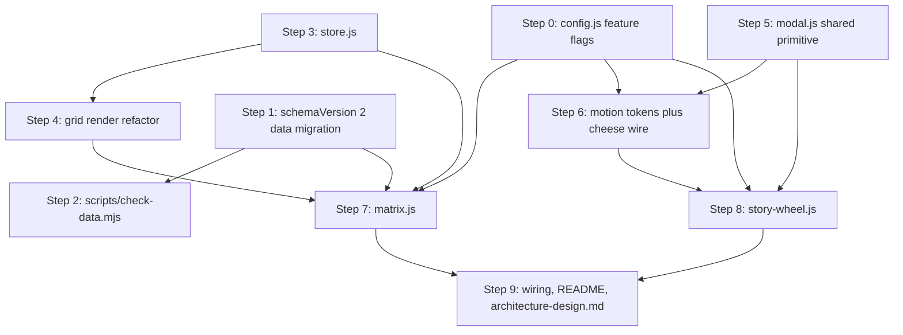
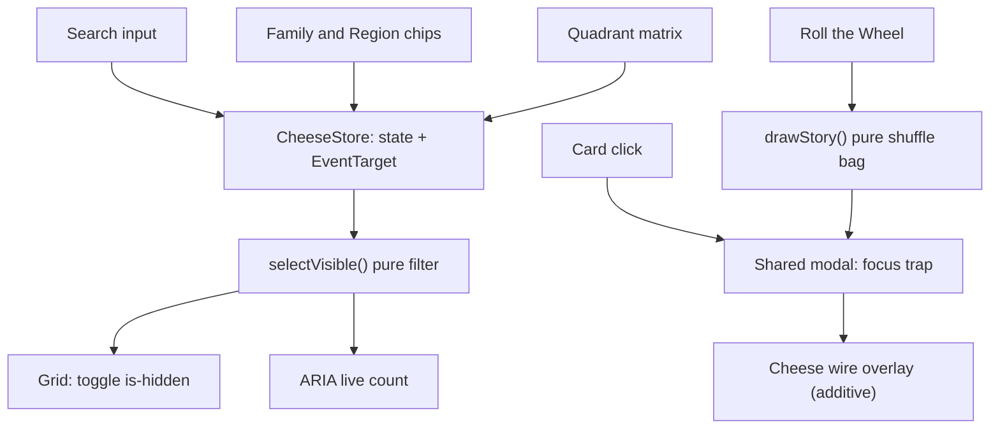

# Implementation Plan — TCA2 Phase 1: The Interactive Core

**Branch:** `tca2/phase-1-interactive-core`
**Scope source:** `docs/TCA2/PHASE-WISE-RELEASE.txt` — Phase 1 = feature 2 (Flavor/Texture Quadrant Matrix), 3b (Cheese Wire Modal Transition), 4 (Surprise Story Wheel)
**Governing constraints:** `docs/development-driving-files/CODING-PRACTICES.txt`
**Status:** Ready to implement, nothing outstanding. Every open question is resolved (9.1–9.13). All 72 axis scores exist in `docs/TCA2/MATRIX-TABLE.json`, cross-verified against two research files. Appendix A’s `isBizarreLore` pool is **approved at 40 cheeses** and is now a fixed input, so Step 1 is entirely mechanical and Step 0 can begin immediately.

**Related documents:** `docs/architecture-design.md` (to be created in Step 9) holds the standing architecture and coding-practice reference, including the feature dependency map. This plan covers Phase 1 only and is expected to go stale once the phase ships.

---

## 1. Starting position

The Atlas today is a zero-dependency vanilla single-page app with no build step:

- `index.html` — page shell: header, sticky `.controls` (search + Family/Region chips), `main.grid-section`, footer, one modal overlay.
- `app.js` — a single 228-line IIFE holding all logic: state object, chip construction, `matches()` filter predicate, `render()`, `openModal()`/`closeModal()`, photo carousel.
- `styles.css` — 451 lines, design tokens in `:root`, CSS-painted family wheels, one global `prefers-reduced-motion` rule.
- `data-part1.js` … `data-part6.js` — 72 cheese records, 12 per file, each file doing `window.CHEESES = (window.CHEESES || []).concat([...])`.
- No tests, no CI, no `package-lock.json`, no runtime dependencies, no `localStorage` usage, no `schemaVersion`.

Three facts that shape everything below:

1. **The Matrix is no longer data-blocked.** Axis scores for all 72 cheeses exist as prior research in `docs/TCA2/MATRIX-TABLE.md` (human-readable, grouped by region, with a justification per cheese) and its machine-readable counterpart `docs/TCA2/MATRIX-TABLE.json`. Both were verified row by row against a second independent research file, `TCA-FULL-DATA-WITH-MATRIX-DATA.md`, which agreed on all 72 entries with no discrepancies and has since been deleted — it was a scraped duplicate of the entire dataset, and keeping a second copy of every cheese's prose in the repo invited exactly the drift this plan avoids.
2. **The grid re-renders destructively.** `render()` does `grid.innerHTML = ""` and rebuilds all 72 cards on every filter change (`app.js:124-138`). Acceptable for a chip click; not acceptable at 60Hz during a crosshair drag.
3. **Reduced motion is a blanket kill switch.** `styles.css:44-47` forces `transition-duration: 0.001ms !important` on everything. Any new animation must be additive, never load-bearing, or reduced-motion users get a broken modal.

### 1.1 What the real axis data actually looks like

This is the section that changed most on re-evaluation. Several assumptions in the original plan turn out to be wrong once the numbers are real.

**Quadrant occupancy is severely lopsided.** Splitting at the 5.5 midpoint on both axes:

- Mild & Soft — 38 cheeses (53% of the catalogue)
- Mild & Hard — 21 cheeses
- Stinky & Soft — 12 cheeses
- Stinky & Hard — **1 cheese** (Appenzeller, at 6/6)

This is not a scoring error. It reflects how cheese actually works: pungency comes overwhelmingly from washed rinds and blues, which are soft; hard cheeses are aged for sharpness, not stink. But it breaks the "tap a quadrant" interaction as originally specified — one quadrant returns a single result and another returns over half the catalogue. See open question 9.10.

**Both axes are skewed toward the low end.**

- `mildStinky`: 53 of 72 cheeses (74%) score 4 or below. Only 13 score 6 or above. The full 1–10 range is used.
- `softHard`: the mode is 2 (15 cheeses). Nothing scores 10, and only Parmigiano Reggiano scores 9.

A linear plot will therefore crowd everything into the bottom-left corner and leave the top-right nearly empty.

**Coordinate collisions are common.** Four cheeses each sit on exactly (1,2), (2,5), (2,7), and (3,8). Any design that plots one dot per cheese needs a collision strategy. See open question 9.11.

**One family fails the spread check the original plan proposed.** All four blues — Gorgonzola (7,4), Stilton (7,4), Roquefort (8,4), Cabrales (9,4) — sit at `softHard: 4`, giving only three distinct coordinates. The proposed "at least 4 distinct coordinates per family" rule in Step 2 would fail on correct data, so the rule has been loosened (see Step 2).

Family spreads, distinct coordinates out of member count: washed-rind 7/7, fresh 10/13, semi-hard 7/12, hard 6/14, whey-other 5/5, pasta-filata 4/6, semi-soft 4/6, soft-ripened 4/5, blue 3/4.

---

## 2. Decisions locked

- **Axis scores already exist and are not being re-derived.** The research in `docs/TCA2/` is the source of truth. Step 1 is now a mechanical, scripted injection of known values rather than an authoring exercise — which removes the largest single risk and the largest single time cost from the original plan.
- **Field names follow the research:** `mildStinky` and `softHard`, not `intensity`/`firmness`. Adopting the names already used in the source data means zero translation layer and no chance of an axis being silently transposed during migration. They are also self-documenting about direction, which a bare `intensity` is not.
- **No test framework in Phase 1.** Instead, `scripts/check-data.mjs` — a plain Node script, zero dependencies — validates the integrity of the cheese records. Filter and picker logic is still written as pure, exported-shaped functions so Phase 2 can add tests without a refactor.
- **No file-size guarding.** The 15–20 KB ceiling that bit this project previously was a payload constraint of the in-chat `deploy_to_vercel` tool, not a Vercel platform limit. On a git-based pipeline the failure mode disappears structurally: real build logs, readable deploy status, and per-branch previews. At 72 records the project is nowhere near Vercel's actual 15,000-file / 100 MB caps.
- **The Matrix is an additive layer**, not a replacement. Search and the Family/Region chips keep working untouched. If `matrix.js` fails to load or throws during init, the site behaves exactly as it does today.
- **Two hero motion moments only:** the cheese wire and the story wheel spotlight. Card tilt (feature 3a) is explicitly out.
- **One shared modal primitive.** The story wheel does not get its own dialog.
- **One feature flag per feature, gating initialization.** Three flags in Phase 1 — `matrix`, `cheeseWire`, `storyWheel` — living in a dependency-free `config.js`. Flags for Phase 2 and 3 features are added when those features are built, not pre-declared. A flag that is off means the module never runs: no DOM injected, no listeners bound, no state written, and `selectVisible` ignores that feature's slice of state. A CSS `display: none` is explicitly *not* an acceptable implementation.
- **Infrastructure is never flagged.** `store.js`, `modal.js`, the grid refactor, the motion tokens, and the schema migration are unconditional. Flagging those would mean maintaining two versions of the app rather than toggling a feature.
- **Flags are a deploy-time switch, not a runtime kill switch.** With no build step and no backend, flipping one is a file edit plus a push — a minute or two on Vercel. This is accepted, but it means flags alone do not cover "it broke in production on a device we did not test." Per-module defensive init covers that half, and both are required.

## 3. Non-goals for Phase 1

Map (1), card tilt / "Roll" reveal (3a), pairing toggle (5a), pronunciation audio (5b), Passport (6a), board builder (6b), Cheese Twin (7a), Compare (7b), command palette (7c), Cheese of the Day (8a), milk-type icons (8b), rarity tags (10a), shareable card (10b).

Also out: URL/hash state, any backend, any `localStorage` write.

---

## 4. Dependencies

### External

- Node 18+ (already required by `package.json` engines) — needed only for `scripts/check-data.mjs`.
- No new npm dependencies. Runtime stays zero-dependency; nothing is added to `package.json` except a `check` script entry.
- Browser APIs used, all baseline-safe: `EventTarget` + `CustomEvent`, `requestAnimationFrame`, `PointerEvent`, `Math.hypot`, inline SVG. No polyfills.
- Vercel static hosting, unchanged. `vercel.json` is not modified.

### Internal step ordering

Steps 1–5 are prerequisites that change no user-visible behaviour (with one deliberate exception: the modal accessibility fix). Features come after.



**Hard rule:** `store.js` (Step 3) lands and absorbs the existing search and chips *before* `matrix.js` is written. Retrofitting a store beneath a shipped feature is how two sources of truth appear.

---

## 5. Implementation steps

### Step 0 — `config.js` and the feature flag system (new)

The first script loaded and the only one with no dependencies of its own.

```js
window.TCA_CONFIG = Object.freeze({
  features: Object.freeze({
    matrix:     true,
    cheeseWire: true,
    storyWheel: true
  })
});
```

**Scope:** three flags, one per Phase 1 feature. Phase 2 and 3 features get their flags when they are built — pre-declaring five `false` entries for features that do not exist yet is dead configuration.

**Contract each flag must satisfy:**

- Off means the module's `init()` is never called. No DOM injected, no event listeners bound, no store writes.
- Off means the feature's entry point disappears with it. Turning off `matrix` also removes the "Filter by taste" disclosure button; turning off `storyWheel` also removes the header button and lets the hero stats reflow cleanly. A flag owns its entire surface, not just its main body.
- Off means `selectVisible` ignores that feature's state slice, so a stale `matrix.active` can never filter the grid with no visible control present.
- Flags gate features only. Never infrastructure.

**QA override.** A `?flags=matrix:off` URL parameter overrides `config.js` at runtime so combinations can be checked without editing and redeploying between each one. There is nothing sensitive to protect here, so no gating on the override itself.

**Supported combinations.** With three flags there are eight states and all eight are testable, so all eight are supported. This is a deliberate reason to keep flag count low — the combination space is the real cost of a flag, not the boolean.

**Defensive init is separate and mandatory.** Every feature module wraps its own setup in try/catch, logs, and leaves the page in its pre-feature state on failure. Flags are the deliberate control for problems already known; defensive init is the automatic one for problems discovered in production. Neither substitutes for the other.

**Lifespan.** A flag is removed once its feature is stable. A flag surviving two phases is dead code with a boolean in front of it.

### Step 1 — Data migration to schemaVersion 2

**Files:** `data-part1.js` … `data-part6.js` (all 72 records)

Each record gains three fields:

```js
schemaVersion: 2,
mildStinky: 4,        // 1 = very mild/delicate, 10 = extremely pungent  -> matrix X axis
softHard: 9,          // 1 = soft/spoonable,     10 = hard/granular      -> matrix Y axis
isBizarreLore: true   // curated Story Wheel pool membership
```

`isBizarreLore` lives on the cheese record rather than in `MATRIX-TABLE.json`. That file has exactly one job — being the enforced source of truth for axis scores — and mixing editorial curation into it would blur the contract that `npm run check` enforces. Pool membership is a property of the cheese, so it belongs with the cheese.

Every record carries the field explicitly, including `false`. A missing value is a validation error, never an implied `false`.

**Step 1 splits into two commits, because the data files are minified.** Each `data-part*.js` is a single ~13 KB line. Injecting fields in place would rewrite that one line, so git would report the entire file deleted and re-added — an unreviewable diff that could hide arbitrary prose changes. The earlier claim of "288 added lines, zero deletions" presupposed a one-key-per-line format the repo does not currently have. Rather than drop that criterion, restore the format it assumes.

The minification is a fossil. These files were flattened to fit the per-push payload limit of the in-chat `deploy_to_vercel` tool — the same 15–20 KB constraint retired under 9.1, which never came from Vercel and does not apply to a git-based pipeline. The reason for the format is gone; the format outlived it. Every future data change in Phases 2–4 hits this same wall until someone reformats, so pay the cost once, here, in isolation.

**Step 1a — reformat only.** Parse each `data-part*.js`, re-emit it pretty-printed with one key per line, and change nothing else. Verify by asserting that `JSON.parse` of the before and after states are deeply equal for all 72 records — a stronger guarantee of zero prose drift than any human reading a diff, since it compares every byte of every field rather than relying on the eye. Commit alone, with no other change. Expect the file size to roughly double; this is irrelevant, as Vercel gzips and there is no size ceiling.

**Step 1b — scripted injection, not hand editing.** `docs/TCA2/MATRIX-TABLE.json` is the machine-readable lookup of `id → { mildStinky, softHard }`. A one-shot Node script reads each reformatted file, matches records by `id`, and inserts the four fields. Against the Step 1a format this yields exactly four added lines per record — 288 lines total, no deletions — so the acceptance criterion holds as originally written and the diff is genuinely reviewable by eye.

This is deliberately *not* a regeneration of the data files from a complete external dataset. Such a file existed (`TCA-FULL-DATA-WITH-MATRIX-DATA.md`, since deleted) but it was scraped from the live site, and regenerating from it would have risked silent prose drift in `history`, `fact`, and `usage` fields that nobody would notice. `data-part1.js`…`data-part6.js` are the sole source of truth for cheese prose.

**Story Wheel pool authoring.** `isBizarreLore` was the one editorial part of this migration, and it is now settled: Appendix A’s **40 approved ids** are the input. Copy the `BIZARRE_LORE_IDS` array from Appendix A into the migration script and set `isBizarreLore: true` for membership, `false` for the other 32 — every record gets the field explicitly, so a missing flag is always a bug rather than an opt-out.

**Pre-migration verification.** Before the script runs, confirm that the set of 72 `id` values in `MATRIX-TABLE.json` matches the set in the live data files exactly. A missing or renamed `id` must fail loudly rather than leave a record unscored.

**Fallback in code.** `matrix.js` keeps a nine-entry `FAMILY_FALLBACK` map used only when a record somehow lacks a score, so a bad merge degrades to a plausible position instead of throwing. Derived from the real data (family medians), not invented:

| Family | mildStinky | softHard |
| --- | --- | --- |
| `fresh` | 2 | 2 |
| `whey-other` | 1 | 2 |
| `semi-soft` | 2 | 3 |
| `soft-ripened` | 5 | 2 |
| `pasta-filata` | 3 | 4 |
| `semi-hard` | 2 | 5 |
| `washed-rind` | 8 | 2 |
| `blue` | 8 | 4 |
| `hard` | 3 | 8 |

**Review gate — already satisfied.** The original plan called for authoring scores into `docs/TCA2/axis-scores.md` for sign-off. That artefact already exists in better form: `MATRIX-TABLE.md` carries all 72 scores with a one-line justification each, and was verified against a second independent dataset with zero discrepancies. No new review document is needed, and no separate sign-off commit is required.

### Step 2 — `scripts/check-data.mjs` (new)

Plain Node script, zero dependencies, wired as `npm run check` in `package.json`. Its job is data integrity only — file-size checking is deliberately excluded (see section 2). Exits non-zero when any of these fail:

- a record is missing `id`, `name`, `family`, `region`, `mildStinky`, `softHard`, `isBizarreLore`, or `schemaVersion`
- `mildStinky` or `softHard` is not an integer in 1–10
- `isBizarreLore` is not a boolean, or the flagged set does not **exactly equal Appendix A’s 40 approved ids**. Now that the pool is signed off, a size range would be a weaker check than it needs to be: swapping one cheese for another keeps the count at 40 while quietly changing the curation. Embed `BIZARRE_LORE_IDS` in the script and assert set equality, reporting unexpected and missing ids separately. Changing the pool is then a deliberate two-file edit — data plus check — which is exactly the friction an approved editorial list should have
- an `id` appears twice
- `family` is not one of the nine known values, or `region` not one of the four
- the record count is not 72, or any `id` in `MATRIX-TABLE.json` has no matching record
- a record's scores disagree with `MATRIX-TABLE.json` — this is the check that actually matters, since it makes the research file the enforced source of truth and turns any future accidental edit into a failed `npm run check` rather than a silently wrong plot position

**Changed from the original plan:** the proposed "every family occupies at least 4 distinct coordinates" rule is dropped. On the real data the blue family has only three distinct coordinates (all four blues sit at `softHard: 4`), so the rule would fail on correct data. A per-family spread check adds nothing now that scores are externally verified rather than hand-typed.

It loads the data by reading the six files as text and evaluating them against a stub `window` object, so it needs no module conversion of the data files.

### Step 3 — `store.js` (new)

Replaces the bare state object at `app.js:38-42`. One source of truth, `EventTarget` pub/sub, no library — exactly what `CODING-PRACTICES.txt` prescribes.

```js
window.CheeseStore = (function(){
  "use strict";
  var bus = new EventTarget();
  var state = {
    query: "",
    family: "all",
    region: "all",
    matrix: { active: false, x: 3, y: 4, radius: 2.0 }
  };

  function get(){ return state; }
  function set(patch){
    // shallow merge, matrix merged one level deeper
    bus.dispatchEvent(new CustomEvent("change", { detail: state }));
  }
  function subscribe(fn){ bus.addEventListener("change", fn); }

  // pure: (state, cheeses) -> filtered array. No DOM access.
  function selectVisible(cheeses){ /* ... */ }

  return { get: get, set: set, subscribe: subscribe, selectVisible: selectVisible };
})();
```

`selectVisible` absorbs the existing `matches()` predicate (`app.js:89-98`) verbatim and appends one clause:

The matrix clause is not a simple predicate, because a fixed radius cannot serve this distribution. Measured against the real data, a radius of 2.5 dropped at (2,3) in the dense region captures 34 of 72 cheeses — not a filter. At 2.0 it is still 26. Drop the radius to 1.5 and the dense case becomes reasonable at 18, but sparse regions then return three cheeses and read as broken.

The fix is to clamp the count as well as the distance:

```js
// pure: sorts by distance, applies radius, then clamps the result count
function matrixFilter(cheeses, m){
  var ranked = cheeses
    .map(function(c){
      return { c: c, d: Math.hypot(c.mildStinky - m.x, c.softHard - m.y) };
    })
    .sort(function(a, b){
      return a.d - b.d || (a.c.id < b.c.id ? -1 : 1);  // stable tiebreak by id
    });

  var within = ranked.filter(function(e){ return e.d <= m.radius; }).length;
  var n = Math.min(Math.max(within, MATRIX_MIN), MATRIX_MAX);  // 6 and 24
  return ranked.slice(0, n);
}
```

`R = 2.0`, floor 6, ceiling 24. Still a pure function of state with no DOM access. The tiebreak by `id` matters — without it, cheeses at equal distance can swap places between renders and the grid flickers during a drag.

The drawn boundary uses the *effective* capture distance (the distance to the last included cheese) rather than `R`, so the visual and the results never disagree.

The crosshair defaults to (3, 4) rather than the geometric centre (5.5, 5.5), because the real data is concentrated in the low-mild, low-firmness region — a crosshair parked at the true centre would sit in a sparse area and make the first drag feel unresponsive. The default is inert anyway while `active` is false; it only determines where the crosshair sits before first use.

Written in the same ES5-flavoured style as the rest of `app.js` (`var`, function expressions, IIFE) for consistency — there is no transpiler and no reason to mix idioms.

**Acceptance:** after this step the site is byte-for-byte identical in behaviour. Search and chips write through the store; nothing else changes.

### Step 4 — Grid rendering refactor in `app.js`

Replace destructive re-render with build-once plus visibility toggling.

- On init, build all 72 cards once and hold them in a `Map` keyed by `cheese.id`, appended in a stable order.
- On every store `change`, compute the visible set and toggle a `.is-hidden` class per card. No DOM construction, no reflow of the whole grid.
- `#resultCount` updates as today.
- Add an ARIA live region (`aria-live="polite"`, visually hidden) announcing the filtered count, per the accessibility requirement in `CODING-PRACTICES.txt`. Debounce announcements so a drag does not spam a screen reader — announce on drag end, not on every frame.
- The empty state becomes a persistent node toggled by the same mechanism rather than one built on demand.

New CSS: `.card.is-hidden { display: none; }`.

### Step 5 — `modal.js` (new, shared primitive)

Extract `openModal`/`closeModal` (`app.js:140-213`) into a reusable dialog consumed by both the cheese detail view and the story wheel spotlight.

API:

```js
Modal.open({ html: "...", label: "Cheese detail", variant: "detail" | "spotlight", onOpen: fn, onClose: fn });
Modal.close();
```

Fixes two genuine gaps in the current implementation:

- **No focus trap.** `index.html:57` declares `role="dialog" aria-modal="true"` and `app.js:160` focuses the close button, but Tab walks straight out into the page behind. Add a Tab/Shift-Tab cycle over focusable descendants.
- **No focus restoration.** Record `document.activeElement` on open and restore it on close, so dismissing a card returns you to that card, not to the top of the document.

Retained as-is: Escape to close, overlay click-outside to close, `document.body.style.overflow` lock. The photo carousel wiring (`wireCarousel`) stays with the detail-view caller and is passed via `onOpen`.

**One forward-looking change with no Phase 1 benefit.** Add `crossOrigin="anonymous"` to the carousel `` tags built in `photoSection` (`app.js:168`). Nothing in Phase 1 needs it. It is included because the Phase 3 Shareable Card exporter (10b) draws cheese imagery onto a canvas, and drawing a cross-origin image without CORS taints the canvas — `toBlob()` then throws a SecurityError instead of producing a file. Wikimedia serves the necessary header, but only if the attribute is set at load time. Setting it now costs one attribute; discovering it in Phase 3 means reopening Phase 1 code. Verify Wikimedia's CORS response before relying on it in Phase 3.

### Step 6 — Motion tokens and the Cheese Wire transition

**`styles.css`** — add to the existing `:root` block alongside the colour tokens:

```css
--motion-fast: 160ms;
--motion-base: 240ms;
--motion-ease: cubic-bezier(0.22, 0.61, 0.36, 1);
```

Every animation in Phase 1 and after uses these. Without shared tokens, Phase 2 invents its own timing and the site stops feeling like one product.

**The wire.** An SVG line overlaid on the dialog that sweeps horizontally across on open, with a thin highlight trailing it, suggesting a cheese wire slicing the panel open.

**Non-negotiable constraint:** the modal renders fully open by default and the wire paints on top as a decorative overlay. It must not animate `clip-path`, `height`, or `opacity` *from* a hidden state, because `styles.css:44-47` collapses all transitions to `0.001ms` under `prefers-reduced-motion` — a load-bearing reveal would leave those users with a modal that never appears. Under reduced motion the wire is simply not rendered.

The overlay element is `aria-hidden="true"` and `pointer-events: none`.

**Flag and failure behaviour:** gated on `TCA_CONFIG.features.cheeseWire`. When off, the overlay is never created and the modal opens plainly — which is exactly what reduced-motion users already get, so this path is exercised by default rather than being a rarely-run branch. The motion tokens themselves are infrastructure and are not flagged.

### Step 7 — `matrix.js` (new) — the flagship

**Placement:** a new `<section class="matrix-section">` in `index.html`, between the sticky `.controls` block and `main.grid-section`.

**Structure:** an inline SVG plot, low-poly, with one dot per cheese, a crosshair marker, a selection-boundary polygon, corner landmark labels, and axis labels reading Mild → Stinky on X and Soft → Hard on Y. Alongside it, a visible "Clear" control that sets `matrix.active` to `false`.

**Interaction model — continuous plane with corner landmarks.** Fixed quadrant hit areas are rejected: "Stinky & Hard" contains exactly one cheese (Appenzeller) and "Mild & Soft" contains 38 of 72, so a quadrant tap returns either a broken-looking single result or half the catalogue. Instead:

- **The whole plane is the target.** Tapping or dragging anywhere drops the crosshair at that point and filters by proximity. There are no separate hit regions.
- **Four corner compass landmarks** — *Mild & Soft*, *Mild & Hard*, *Stinky & Soft*, *Stinky & Hard* — sit as static labels for orientation.
- **Landmarks snap to the nearest occupied coordinate**, not to the geometric corner. This is what makes the sparse corners usable: the label stays meaningful while the crosshair lands somewhere with cheeses in range.

**Landmark targets are derived at init from the data, never hardcoded.** For each corner, take the cheese minimising distance to that corner subject to actually being in the corner's half-planes where any candidate exists. On current data *Stinky & Hard* resolves to Appenzeller (6,6), which returns Appenzeller, Pecorino Romano, Idiazábal, Provolone, Caciocavallo, Oscypek, Gorgonzola and Stilton — a coherent bold-and-firm set. Deriving rather than hardcoding also means the targets self-correct if scores are ever revised.

The live result count must be visible during interaction, not only after it.

**Initial state:** inactive on load. All 72 cheeses are visible and the Matrix reads as an invitation, not a pre-applied filter a first-time visitor has to undo.

**Responsive behaviour:** expanded by default on desktop; on small viewports it collapses behind a "Filter by taste" disclosure button. Implemented as a real `<button aria-expanded>` controlling the section, not a CSS-only toggle, so the state is exposed to assistive tech. Collapsing protects the grid from being pushed below the fold while keeping the plot full-size once opened. If a matrix filter is active while collapsed, the toggle label shows that a taste filter is applied so the narrowed grid is never unexplained.

**Input methods, mobile-first** (per the design requirement that every hover/drag idea ships with a tap-and-keyboard sibling):

- **Tap the plane** — primary gesture on touch. Drops the crosshair at the tapped point. Sets `matrix.active = true`.
- **Tap a corner landmark** — snaps the crosshair to that corner's nearest occupied coordinate, with a short animated transition.
- **Drag the crosshair** — desktop refinement. Continuous proximity filtering.
- **Keyboard** — arrow keys move the crosshair one unit; Shift+arrow moves five; Home resets; Escape clears the filter. The crosshair is a real focusable element with `role="slider"`-style labelling and an accessible name describing its current position. Corner landmarks are focusable buttons, giving keyboard users the same shortcut as the tap gesture.
- **Clear** — restores the unfiltered grid, leaving search and chips as they were.

All input paths write the same `{ active, x, y, radius }` shape to the store, so there is one code path downstream.

**Axis rendering.** Both axes map over the *observed* domain, not a nominal 0–10, because mapping from zero leaves permanent dead margins — 17.8% on the left and 11% at the bottom on this dataset.

```js
// X: power curve, expands the crowded mild end
xPixel = W * Math.pow((mildStinky - X_MIN) / (X_MAX - X_MIN), 0.75);
// Y: linear, hardness is already evenly spread
yPixel = H * (1 - (softHard - Y_MIN) / (Y_MAX - Y_MIN));
```

`X_MIN`/`X_MAX`/`Y_MIN`/`Y_MAX` are derived from the data at init, never hardcoded to today's 1–10 and 1–9. Hardcoding the current maximum means a future harder cheese plots above the top border.

The power curve applies to X only. It gives the 1–3 band 32.4% of the width against 22.2% for linear, which is worth having. Hardness is spread fairly evenly from 1 to 8 with only a mild spike at 2, so Y stays linear and remains readable as an absolute scale.

**Display scaling never affects the filter.** Distance is always computed in raw score units so the same crosshair position returns the same cheeses on every viewport. The consequence is that the selection boundary is *not* a circle on screen once X is non-linearly compressed — an SVG `<circle>` would visibly disagree with which dots are selected. Draw the boundary as a polygon by transforming ~48 sampled points around the circle each frame. The arithmetic is negligible and the result is honest.

**Collision offsets.** 72 cheeses occupy 38 distinct coordinates. The largest clusters hold four cheeses each, at (1,2), (2,5), (2,7) and (3,8). Separate co-located dots with a deterministic Fermat spiral so the layout is stable across renders:

```js
theta = k * 137.5 degrees;   // golden angle
r     = c * Math.sqrt(k);    // c expressed as a fraction of one data unit in display space
```

The jittered position is for rendering only. Distance calculations always use the true coordinate, or clicking a dot and the crosshair maths will disagree.

**Performance budget** (must update within a frame on a mid-range Android):

- `pointermove` handlers coalesced through `requestAnimationFrame`; at most one state write per frame.
- The crosshair moves via `transform: translate()` only — never `left`/`top` — so it never triggers layout.
- Grid updates are class toggles from Step 4, not DOM construction.
- Pointer capture on the crosshair so a fast drag that leaves the SVG does not drop the gesture.

**Flag and failure behaviour:** gated on `TCA_CONFIG.features.matrix`. When off, the section and its "Filter by taste" disclosure button are never created and `selectVisible` skips the matrix clause entirely. Independently of the flag, the whole module is wrapped so that a throw during init leaves the section absent and the rest of the page fully functional.

### Step 8 — `story-wheel.js` (new)

**Trigger:** a "Roll the Wheel" button in the site header, beside the hero stats.

**Pool:** the wheel draws from the 40 cheeses flagged `isBizarreLore` (Appendix A, approved). There is deliberately **no user-facing toggle to widen the pool to all 72.** A control that amounts to "also show me the less interesting ones" exposes internal editorial judgement as a setting and makes the curated default feel like something is being withheld. If re-roll data later shows people exhausting the pool, the answer is to widen it in the data, which is an edit rather than a feature.

**Pure picker — a shuffle bag, not a single-item memory.** The original spec avoided only the previously shown cheese. That is adequate against 72 candidates but not against a curated pool, where the same cheese reappearing three times in ten rolls would read as broken even though it matched the specification exactly. At the approved pool size of 40 the bag guarantees 40 distinct cheeses before any repeat, which comfortably outlasts any realistic session.

```js
// Pure. Deterministic for a given seed. Returns the pick and the remaining bag,
// reshuffling only once the pool is exhausted, so every cheese appears before any repeats.
function drawStory(pool, seed, bag){
  // -> { cheese, bag }
}
```

The UI holds the bag and passes it back in on each roll. Keeping both the seed and the bag injectable is what makes this testable in Phase 2 without touching the UI.

**Presentation:** rendered through `Modal.open` with `variant: "spotlight"` — a typography-first, high-contrast pull-quote treatment over the existing `fact` field.

The text layout is designed to be complete on its own and is identical for all pool members. For the subset with an `images` entry, the photo renders in a secondary frame — alongside the quote on desktop, below it on mobile. **The photo is additive, never load-bearing**, the same rule the cheese wire follows: a cheese without one must not leave a hole or a placeholder. Set `crossOrigin="anonymous"` here as well as on the carousel, for the same Phase 3 canvas reason. No `loading="lazy"` — the modal is already open and the image is immediately in view, so deferring it only delays the reveal.

Inside the spotlight: a "Roll again" control (the feature's success metric is re-roll rate) and a link through to that cheese's full detail view.

**Flag and failure behaviour:** gated on `TCA_CONFIG.features.storyWheel`. When off, the header button is never created and the hero stats reflow as though it had never existed. Wrapped in defensive init like every other feature module.

**Note for Phase 3:** `drawStory` is deliberately shaped so that Cheese of the Day (8a) is the same function with a date-derived seed and a bag of one per day. Keeping the seed and bag injectable here is what prevents that logic being written twice.

### Step 9 — Wiring and docs

**`index.html`** script load order becomes:

```html
<script src="config.js"></script>
<script src="data-part1.js"></script>
<!-- ... through data-part6.js ... -->
<script src="store.js"></script>
<script src="modal.js"></script>
<script src="matrix.js"></script>
<script src="story-wheel.js"></script>
<script src="app.js"></script>
```

`config.js` loads first because every other module reads it. `app.js` remains the orchestrator that initialises the others, consulting the flags before calling each `init()`.

**`README.md`** — update the data model section for `schemaVersion`, `mildStinky`, `softHard`; add the new files to the project layout; document `npm run check`; note the new Matrix and Story Wheel components.

**`docs/architecture-design.md`** (new) — the standing architecture and coding-practice reference for the project, distinct from this document. This plan describes one phase and goes stale when the phase ships; `architecture-design.md` describes how the project is built and stays current. It should cover:

- **Architectural principles** — vanilla, zero-dependency, no build step, and why; progressive enhancement as a rule rather than a per-feature note; additive animation.
- **Module contract** — every feature module exposes `init()`, is gated on a flag, wraps setup in try/catch, and owns its entire surface including its entry point.
- **State management** — the single store, the `EventTarget` pub/sub pattern, and the rule that `selectVisible` stays pure and DOM-free.
- **Feature flags** — the contract from Step 0, the deploy-time-not-runtime limitation, and the removal policy.
- **Feature dependency map** — the three coupling clusters (filter/grid, modal surface, deterministic picker), the features that span them, and known cross-phase couplings such as the canvas CORS constraint. This is the section that prevents a future phase assuming the eight features are independent when they are not.
- **Data architecture** — chunked data files, `schemaVersion` and how to migrate it, the axis-score research files as source of truth, and `npm run check` as the enforcement point.
- **Accessibility baseline** — keyboard equivalent for every pointer gesture, focus trapping and restoration in dialogs, ARIA live regions for filtered counts, `prefers-reduced-motion` handling.
- **Conventions** — ES5-flavoured style to match the existing code, `escapeHtml` on all interpolated data, namespaced and versioned `localStorage` keys wrapped in try/catch.

It consolidates and supersedes the advice in `docs/development-driving-files/CODING-PRACTICES.txt`, which should be annotated as historical once this exists — including the size-check guidance already retired in 9.1.

---

## 6. Data flow after the change



---

## 7. Acceptance criteria

**Matrix**

- No crosshair position anywhere on the plane returns fewer than 6 or more than 24 cheeses.
- Each of the four corner landmarks snaps to an occupied coordinate and returns a set that matches its label — in particular, tapping *Stinky & Hard* returns firm cheeses, not the pungent-soft cluster.
- The drawn selection boundary matches the selected dots exactly at every crosshair position, including deep in the compressed left-hand region of the X axis.
- Dots at shared coordinates are visually separated and land in the same place on every reload.
- Dragging across a region where cheeses tie on distance produces no flicker in the grid.
- The live result count is visible during interaction, not only after it.
- Dragging the crosshair updates the grid continuously with no visible stutter on a throttled mid-range mobile profile.
- Arrow keys, Home, and Escape drive the crosshair with no pointer input.
- Clearing the matrix restores the grid subject to whatever search and chip filters are active.
- Matrix, search, and chips compose: a matrix selection plus a region chip narrows correctly rather than one overriding the other.
- With `matrix.js` removed from the page, the site behaves exactly as it does on `main`.

**Cheese wire**

- The modal is fully readable with `prefers-reduced-motion: reduce` enabled; the wire is absent, not broken.
- The wire never intercepts pointer events and is invisible to assistive tech.

**Modal**

- Tab and Shift-Tab stay inside the dialog.
- Closing returns focus to the element that opened it.
- Escape and click-outside still close.

**Story Wheel**

- Rolling the full length of the pool produces every member exactly once before any cheese repeats.
- The spotlight is complete and well-composed for a cheese with no photo — no holes, no placeholders.
- "Roll again" works from inside the spotlight.
- The spotlight closes cleanly and restores focus to the header button.

**Feature flags**

- All eight combinations of the three flags produce a coherent page with no orphaned buttons, no layout holes, and no console errors.
- With `matrix: false`, no matrix DOM exists, no pointer listeners are bound, and the grid is unfiltered even if `matrix.active` is forced true in the store.
- With `storyWheel: false`, the header renders as it does on `main`.
- With `cheeseWire: false`, the modal opens plainly and remains fully usable.
- `?flags=matrix:off` overrides `config.js` without a redeploy.
- Forcing a throw inside any feature's `init()` leaves the rest of the page fully functional.

**Data**

- `npm run check` passes.
- All 72 records carry `schemaVersion: 2`, `mildStinky`, `softHard`, and an explicit `isBizarreLore`.
- Every record's scores match `docs/TCA2/MATRIX-TABLE.json` exactly.
- The Story Wheel pool is exactly the 40 approved ids in Appendix A, and `npm run check` fails if it drifts by even one entry.
- The Step 1a reformat commit changes no data: `JSON.parse` before and after are deeply equal across all 72 records.
- The Step 1b migration diff contains only additions — 288 added lines, zero deletions, no prose changed.

---

## 8. Risk register

- ~~**Editorial scores are subjective and unverified.**~~ Substantially retired. Scores were authored as prior research, carry a written justification each, and have been cross-verified across two independent files with zero discrepancies. The residual risk is transcription during migration, which is handled by scripting the injection and having `npm run check` enforce agreement with `MATRIX-TABLE.json`.
- **Flags create a false sense of safety.** A boolean protects against problems already known. The common production failure — an exception on an untested device — is only covered by per-module defensive init, which is why both are mandatory rather than either alone. Flags are also deploy-time here, so "flip it off" still means a push.
- **The eight features are not independent.** They form three coupling clusters (filter/grid, modal surface, deterministic picker), Passport spans all three, and the Shareable Card exporter depends on a `crossOrigin` decision made in Phase 1. Treating them as independent is the main architectural trap across phases; the dependency map in `architecture-design.md` exists specifically to prevent it.
- **Quadrant imbalance.** Resolved by the continuous-plane model plus count clamping (9.10, 9.13). The underlying skew remains — one quadrant genuinely holds a single cheese — so any future feature that assumes an even spread across the plane needs the same treatment.
- **Externally supplied analysis.** The matrix design was adopted from a document whose supporting arithmetic proved substantially wrong (see the note under section 9). Every figure was re-derived before use. Worth remembering as a pattern: adopt the architecture, re-derive the numbers.
- **Drag performance on low-end devices.** Mitigated by Step 4 landing before Step 7; if it still janks, fall back to filtering on drag end rather than continuously.
- **Store refactor regression.** Steps 3–4 touch working code with no test net. Mitigated by keeping them behaviour-neutral and committing them separately so they can be reverted independently.
- **Vertical space.** Resolved by collapsing the Matrix behind a disclosure on small viewports (9.4). Residual risk: a collapsed Matrix is a discoverability problem on mobile — the flagship feature is one tap away from invisible. Worth watching once it is live.
- ~~**No read-back on deploy.**~~ Retired. This risk came from the in-chat deploy tool, which pushed inline file content with no status returned. On the git-based pipeline there are build logs, deploy status, and a readable file tree, so a silently dropped file is no longer a plausible outcome.

---

## 9. Open questions — needed before or during implementation

**9.1 — File-size ceiling. RESOLVED: no ceiling, drop the check.** *(Unblocks Step 2)*
The 15–20 KB limit that caused the original silent drop was a per-push payload constraint of the in-chat `deploy_to_vercel` tool, not Vercel enforcing anything. Moving to a git-based pipeline removes the failure mode structurally rather than papering over it with a pre-check. `scripts/check-data.mjs` therefore validates record integrity only. The advice in `CODING-PRACTICES.txt` about a size-check script and manual preview workarounds is superseded and should be annotated as such.

**9.2 — Score review. MOOT: the artefact already exists.** *(Unblocks Step 1)*
No `axis-scores.md` needs authoring. `MATRIX-TABLE.md` already provides all 72 scores with justifications, verified against a second independent research file with zero discrepancies. `MATRIX-TABLE.json` is its machine-readable counterpart and the input to the migration script.

**9.3 — Matrix initial state. RESOLVED: inactive on load.** *(Unblocks Step 7)*
Grid shows all 72; the Matrix is an invitation rather than a pre-applied filter.

**9.4 — Matrix on mobile. RESOLVED: collapsed behind a disclosure.** *(Unblocks Step 7)*
Expanded on desktop, collapsed behind a "Filter by taste" button on small viewports. See Step 7.

**9.5 — Story Wheel pool. RESOLVED: curated subset via `isBizarreLore`, no user toggle.** *(Unblocks Step 8)*
40 cheeses flagged on the cheese record, not in `MATRIX-TABLE.json` — approved, listed in Appendix A. The proposed user-facing control to widen the pool to all 72 is cut. A shuffle-bag picker replaces the previous "avoid the last one" rule, which would have felt repetitive against a curated pool. See Step 8.

**9.6 — Spotlight photos. RESOLVED: typography-first, photo additive.** *(Unblocks Step 8)*
Text layout complete on its own for every pool member; photo in a secondary frame for those that have one, alongside on desktop and below on mobile. Same "never load-bearing" rule as the cheese wire. See Step 8.

**9.7 — Per-branch previews. RESOLVED: free with the git integration.** *(Affects review)*
Vercel's Git integration produces a preview deployment per branch automatically, so the Matrix can be reviewed on a real phone from the `tca2/phase-1-interactive-core` branch before it merges. No manual setup needed.

**9.8 — Committing the docs folders. RESOLVED: yes, as commit 1 on this branch.** *(Unblocks the commit sequence)*
`docs/TCA2/` and `docs/development-driving-files/` are tracked and committed on `tca2/phase-1-interactive-core`, reaching main through the pull request like every other change. The external spec proposed committing them "on the main branch" directly; that is rejected, since bypassing the branch workflow is precisely what the workflow exists to prevent.

Worth stating explicitly: `scripts/check-data.mjs` reads `docs/TCA2/MATRIX-TABLE.json`, so the docs directory is now load-bearing for validation. It is a dev-time script only and never ships to the browser, so the location is acceptable — but nobody should "tidy up" `docs/` without checking what reads from it.

**9.9 — Radius default. RESOLVED: 2.0 units, as a tunable constant.** *(Unblocks Step 3)*
Lowered from 2.5 once real density was known. Recorded as a named constant rather than a frozen decision: with count clamping in place, R only governs behaviour between the floor of 6 and the ceiling of 24, so it matters less than it did and should still be tuned against the live plot.

**9.10 — Plane division. RESOLVED: continuous plane with data-derived corner landmarks.** *(Unblocks Step 7)*
No fixed quadrant hit areas. The whole plane is the target; four corner labels snap the crosshair to the nearest occupied coordinate. See Step 7. Adopted from the external spec, with its suggested *Stinky & Hard* target corrected — it proposed Cabrales (9,4), a cheese with a hardness score of 4, which would return eight soft cheeses under a label promising hard ones.

**9.11 — Overlapping cheeses. RESOLVED: plot dots with deterministic Fermat spiral offsets.** *(Unblocks Step 7)*
72 cheeses across 38 distinct coordinates; largest clusters hold four, at (1,2), (2,5), (2,7) and (3,8). Rendering offsets only — distance maths always uses true coordinates. See Step 7.

**9.12 — Axis scaling. RESOLVED: observed-domain mapping, power curve on X only.** *(Unblocks Step 7)*
Bounds derived from data at init. Power exponent 0.75 on `mildStinky`, linear on `softHard`. See Step 7.

**9.13 — Density clamping. RESOLVED: radius 2.0 with a count floor of 6 and ceiling of 24.** *(Unblocks Steps 3 and 7)*
A fixed radius alone cannot serve this distribution — 2.5 returns 34 of 72 in the dense region and 8 in sparse regions. This gap was not addressed by the external spec. See Step 3.

### A note on the source of 9.5, 9.6, 9.8 and 9.9

Adopted from a second external spec (`gemini-code-1786177197851.md`, reviewed and since deleted), which was markedly more reliable than the earlier document. Its section 1 restated the corrected matrix design accurately — including the Appenzeller landmark, observed-domain mapping, the transform-sampled polygon boundary, and the clamping added under 9.13 — and its cited clusters at (1,2) and (2,5) both check out, including the one the earlier document missed. Three corrections were still needed:

- It placed `isBizarreLore` in `MATRIX-TABLE.json`. Moved onto the cheese record, so that file keeps its single enforced job.
- It did not notice that any curated pool makes the existing "avoid the previous cheese" rule too weak. Replaced with a shuffle bag.
- It proposed committing the docs folders directly to main, bypassing the branch workflow. They go on the feature branch.

The proposed user-facing toggle to widen the pool to all 72 was cut on product grounds rather than corrected.

### A note on the source of 9.10–9.12

These were adopted from an external spec (`gemini-code-1786176321445.md`, reviewed and since deleted). Its three architectural recommendations are sound and are adopted. Its supporting data analysis was not reliable and every figure in it was re-derived from `MATRIX-TABLE.json` before use. The specifics are recorded below because they are the reason the document was removed rather than kept for reference — the corrected conclusions are already in this plan, and the file itself only offered a way to reintroduce the errors:

- Four of its five listed collision clusters are wrong. It places Labneh at (1,1) when it is (2,1); Butterkäse at (2,3) when it is (1,3); Domiati at (2,3) when it is (3,3); Cantal at (3,8) when it is (3,7). It misses Grana Padano and Cheddar at (3,8), Emmental at (2,7), and the entire four-item cluster at (2,5). Its claimed five-item cluster does not exist — the maximum is four.
- Its *Stinky & Hard* landmark target is a soft cheese, and section 1.3 describes Cabrales as a "pungent hard cheese".
- Both scaling formulas map from zero rather than the observed minimum, leaving 17.8% dead space on the left and 11% at the bottom. Its claim that the 1–3 band would occupy 42% of width is wrong; its own formula yields 22.7%.
- Sections 1.2 and 3.2 contradict each other. Euclidean distance in raw units combined with a non-linear display transform means the selection region is not a circle on screen, which the document never addresses.
- It offers no solution to the density problem, which is the single biggest usability risk in the feature.

---

## 10. Suggested commit sequence

1. `chore: add TCA2 planning and research docs` (resolves 9.8, if agreed — includes `MATRIX-TABLE.json`) — **done, `74e4851`**
2. `style: pretty-print cheese data files` (Step 1a — reformat only, no data change, verified by deep-equal)
3. `data: migrate cheese records to schemaVersion 2 with mildStinky and softHard` (Step 1b)
4. `build: add cheese data integrity validation script`
5. `feat: add config.js feature flag system`
6. `refactor: introduce central store with EventTarget pub/sub`
7. `perf: build grid once and filter by visibility toggle`
8. `refactor: extract shared modal primitive with focus trap`
9. `feat: add motion tokens and cheese wire modal transition`
10. `feat: add flavor and texture matrix`
11. `feat: add surprise story wheel`
12. `docs: add architecture-design.md and update README`

Commits 2–8 are behaviour-neutral and independently revertible, the one deliberate exception being the modal focus-trap fix in commit 8.

---

## Appendix A — `isBizarreLore` pool — APPROVED, 40 of 72

**Signed off. This list is final and is the input to Step 1.** No further review gate; Step 1 is now fully mechanical.

Merged from the earlier 28-cheese draft and a curated list of 25 (`BIZZARE-LORE.md`, since deleted — its selection and justifications are fully reproduced below) — 12 net-new, 13 overlapping. Entries marked **(new)** came from that file. Justifications prefer the site's existing `fact` text; a handful of the new rows lean on the lore rationale from that file and are worth a glance against the live `fact` field during migration, but this does not gate the work.

**Canonical id list — copy this verbatim into the migration and validation scripts:**

```js
const BIZARRE_LORE_IDS = [
  "american-cheese", "appenzeller", "brie-de-meaux", "brunost", "cabrales",
  "casu-marzu", "chechil", "cheddar", "chevre", "comte",
  "cotija", "cream-cheese", "domiati", "double-gloucester", "edam",
  "emmental", "epoisses", "feta", "gorgonzola", "gouda",
  "gruyere", "halloumi", "humboldt-fog", "idiazabal", "jarlsberg",
  "limburger", "morbier", "munster", "neufchatel", "oscypek",
  "parmigiano-reggiano", "pecorino-romano", "reblochon", "roquefort", "stilton",
  "stinking-bishop", "taleggio", "vacherin-mont-dor", "vieux-boulogne", "wensleydale"
];
```

**Crime and heists**
- `parmigiano-reggiano` — accepted as bank loan collateral; a Modena gang stole 2,000+ wheels; Pepys buried his in 1666
- `cheddar` — a fake distributor conned Neal's Yard out of 22 tonnes worth over £300,000 in 2024
- `comte` — 100+ wheels, 8,000 lbs, roughly $155,000, taken in a 2015 warehouse raid
- `cabrales` **(new)** — Asturian cave blue; one wheel sold at auction for over €30,000

**Disaster and danger**
- `brunost` — 27 tonnes burned for days in a Norwegian road tunnel, fuelled by its own fat and sugar
- `casu-marzu` — live larvae, Guinness "most dangerous cheese", banned since 1962, leaps off the plate

**Smell, scientifically measured**
- `vieux-boulogne` — crowned world's smelliest by Cranfield; reportedly detected at 50 metres
- `epoisses` — widely reported as banned on French public transport
- `limburger` — shares its rind bacteria with human foot odour; a vaudeville punchline for decades
- `taleggio` — same bacteria; a ripe wheel and a worn sneaker smell genuinely alike
- `munster` **(new)** — Cranfield #4 smelliest; Benedictine monastic origin

**Pop culture**
- `stinking-bishop` — after *The Curse of the Were-Rabbit*, demand rose 500% overnight
- `wensleydale` — Wallace and Gromit are credited with saving the creamery from closure

**Absurd sport**
- `double-gloucester` — chased down a 200-yard hill at nearly 70mph, reliably sending competitors to hospital

**Law, war and naming**
- `stilton` — legally cannot be made in the village of Stilton
- `halloumi` — the "halloumi wars" against Grilloumi, BBQloumi and Grilloumaki; also grills without melting
- `feta` — the decades-long EU feta war, most recently against Denmark in 2022
- `gruyere` — a 2023 US court ruled anyone may call their cheese gruyere
- `jarlsberg` — defined by a patented bacterial culture, so authenticity is corporate rather than geographic
- `gouda` — wax-coated wheels reportedly fired as improvised cannonballs
- `edam` — the same trick at the 1573 Siege of Alkmaar
- `neufchatel` — heart-shaped as a gift to occupying English soldiers during the Hundred Years' War
- `american-cheese` — engineered so the US Army could ship cheese overseas in WWI

**Science and archaeology**
- `emmental` — its holes were vanishing until 2015 research traced them to barn hay dust
- `domiati` — a relative found in a Saqqara tomb, roughly 3,200 years old

**Origin legends**
- `roquefort` — a shepherd abandoned lunch in a cave to chase a woman; first legally protected cheese, 1666
- `reblochon` — named after the medieval second milking farmers hid from the tax collector
- `brie-de-meaux` — voted king of cheeses at the 1815 Congress of Vienna, mid-redrawing of Europe
- `pecorino-romano` — issued to Roman legionaries at about 27 grams a day
- `gorgonzola` **(new)** — blue-vein origin story: an apprentice left curd overnight while meeting a lover
- `morbier` **(new)** — ash line originally protected morning curds until the evening milking

**Craft, place and naming quirks**
- `cream-cheese` — Philadelphia brand, invented in New York, named for a city it has no connection to
- `appenzeller` **(new)** — herbal-and-wine rind wash kept as a closely guarded trade secret
- `chevre` **(new)** — *Crottin* literally means "horse droppings," from the aged cheese's shape
- `vacherin-mont-dor` **(new)** — bound in spruce bark; spooned molten from the box at peak ripeness
- `oscypek` **(new)** — hand-pressed in carved wooden molds, then wood-smoked in the Tatras
- `idiazabal` **(new)** — Basque sheep cheese traditionally smoked over beech or hawthorn in shepherd huts
- `humboldt-fog` **(new)** — ash line designed as a landscape metaphor for Humboldt County fog
- `chechil` **(new)** — hand-braided string cheese, a folk craft as much as a snack
- `cotija` **(new)** — "Mexican Parmesan"; aged hard and crumbly, developed independently of Italian hard cheeses

**Provenance:** 25 ids came from the curated lore list; 15 are unique to this appendix — `cheddar`, `comte`, `wensleydale`, `feta`, `gruyere`, `jarlsberg`, `gouda`, `edam`, `neufchatel`, `american-cheese`, `emmental`, `domiati`, `reblochon`, `pecorino-romano`, `cream-cheese`.

**Photo coverage:** 13 of the 40 carry an `images` entry — Parmigiano, Brie, Roquefort, Gruyère, Emmental, Cheddar, Stilton, Gouda, Edam, Feta, Halloumi, Cream Cheese and Gorgonzola. Frequent enough that the photo frame is worth designing properly, rare enough that text-only remains the norm — which is why the photo stays additive.

**Pool size at 40 of 72** is 56% of the catalogue, wider than the ~25 originally envisaged. The consequence is a longer shuffle-bag cycle before any repeat, which is fine, and a slightly lower average "strangeness" per roll, which is the accepted trade. If re-roll data later suggests dilution, trimming is a data edit requiring no code change.

**Excluded** (in neither source list): Camembert, Mascarpone, Manchego, Skyr, Havarti, Burrata, and similar mild-but-not-strange entries.
